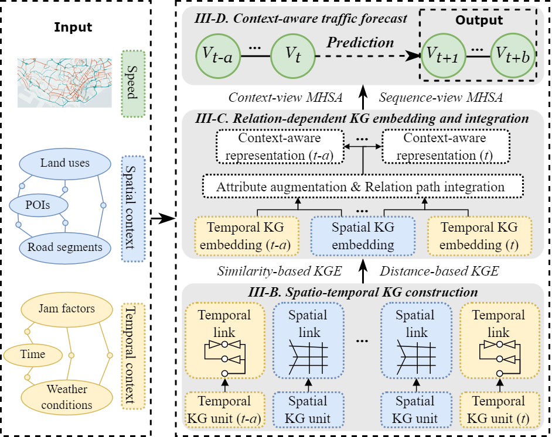

## Introduction
We propose a **context-aware knowledge graph (CKG)** framework to effectively model and embed the spatio-temporal relationships inherent in diverse urban contexts. This framework facilitates the integration of various context datasets into machine-readable formats. Then, we strategically combine the proposed CKG framework with GNN through dual-view multi-head self-attention (MHSA) techniques to forecast traffic speed. This integration ensures that CKG-based context representations can be effectively incorporated into traffic forecasting models, leveraging the strengths of both knowledge graphs and advanced neural network architectures to improve predictive performance.

<center>
  
</center>

---

## Code structure
Here, we introduce the main files for the proposed CKG-GNN model.

- **`run_model.py`**: Script to run the CKG-GNN model. Key parameters:
  - `--task`: `"traffic_state_pred"` - Used for traffic speed prediction.
  - `--dataset`: `"speed_test_data"` - Refers to the test dataset name. Replace with your custom dataset.
  - `--model`: `"CKGGNN"` - Refers to the proposed context-based traffic forecasting model. Can be replaced with other models like TGCN, STGCN, or DCRNN.
  - `--batch_size`: `"16"` - Batch size for running the experiment.
  - `--max_epoch`: `"300"` - Maximum number of epochs for running the experiment.

- **`libcity/model/traffic_speed_prediction/CKGGNN.py`**: Implementation of the proposed CKG-GNN model.
- **`libcity/pipeline/pipeline.py`**: Contains the complete pipeline for the CKG-GNN model.
- **`libcity/pipeline/embedkg_template.py`**: Script for constructing context-based knowledge graphs (CKG).
- **`libcity/data/dataset/traffic_state_contextkg_dataset.py`**: Script for loading datasets.

---

## Data files

Data files are not included in the repository. Please refer to the instruction files in the following directories for details on how to download and place the required data:
- `raw_data/README.md`: Instructions for raw speed data.
- `kg_data/README.md`: Instructions for knowledge graph data.

---

## Running
To test the CKG-GNN model with the provided dataset, run the `run_model.py` script:

```bash
python run_model.py --task traffic_state_pred --dataset speed_test_data --model CKGGNN --batch_size 16 --max_epoch 300
```

---

## Related materials
The code repository includes several Python scripts provided by LibCity. For a detailed tutorial and further documentation, please visit the [LibCity Documentation](https://bigscity-libcity-docs.readthedocs.io/en/latest/get_started/introduction.html).
